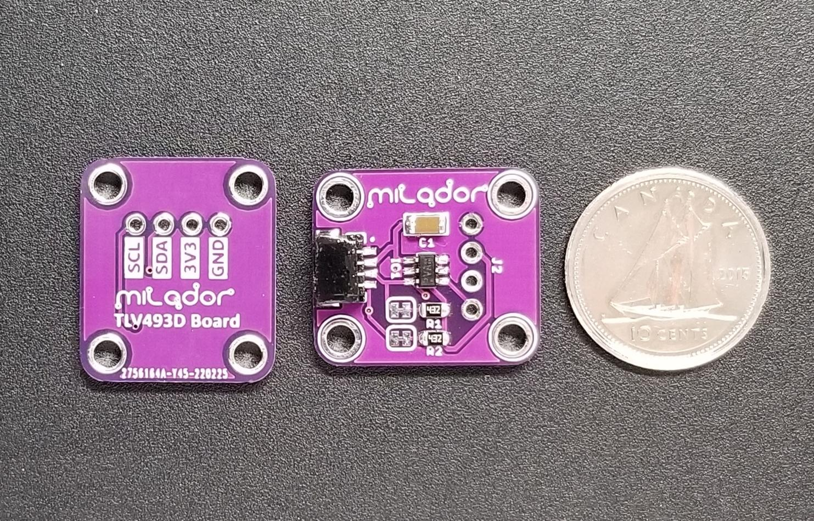

# TLV493D-Board

This is a 3-axis magnetometer board based on Infineon TLV493D 3D magnetic sensor. The board provides both Qwiic/STEMMA connector and a 4 pin header which can be used to read sensor data through I2C communication protocol.

